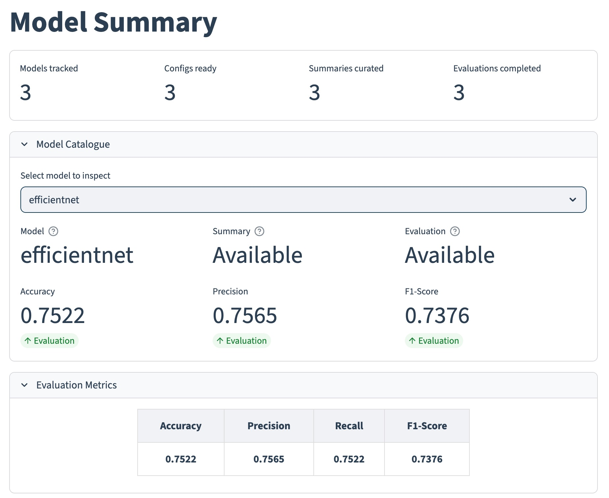
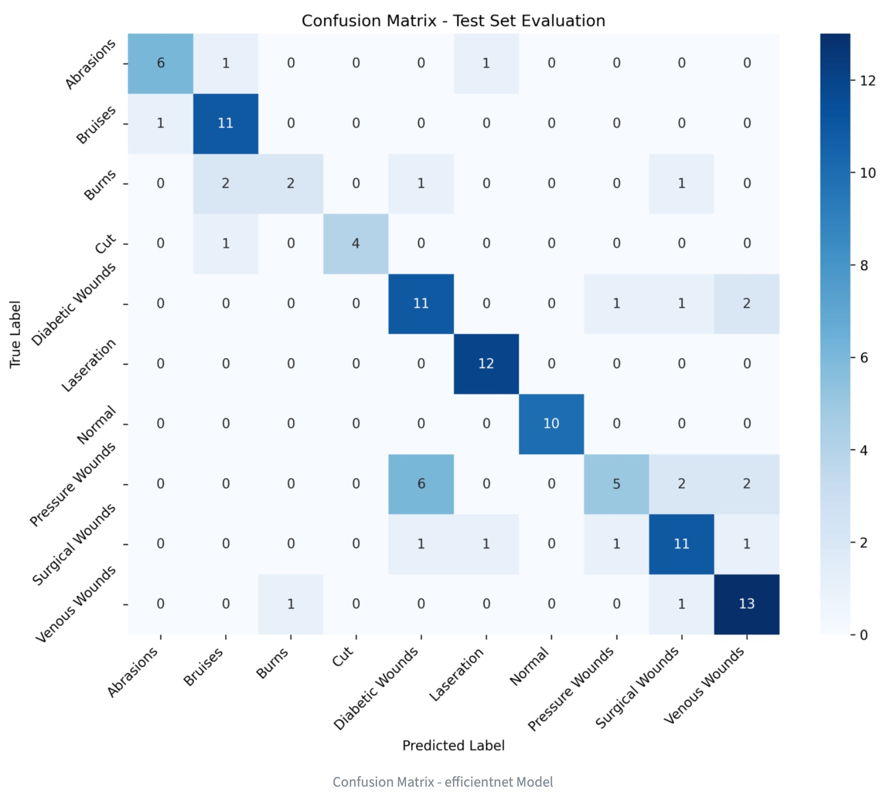
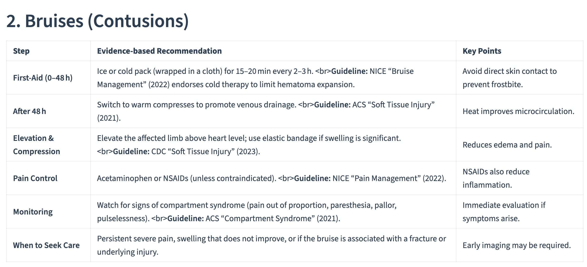
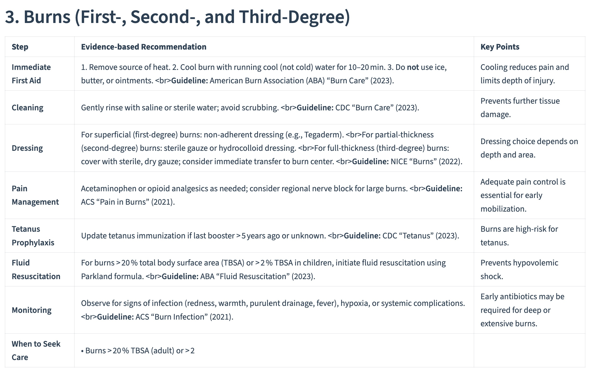
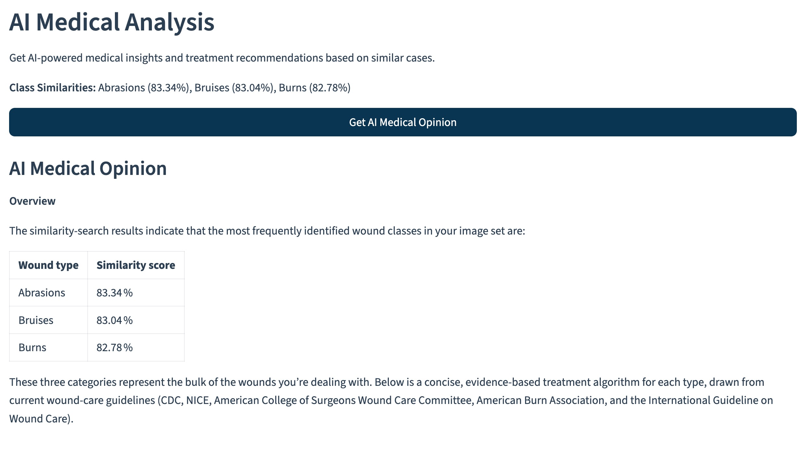

# Wound Detection Platform

AI-assisted wound classification and similarity-search toolkit for clinical research and rapid prototyping.

Built for research and prototype deployments (Columbia University, Deep Learning — Fall 2025), this repository combines model training, feature-vector generation, and a lightweight Streamlit UI so clinicians and researchers can:

- Train and evaluate multi-class wound classifiers that output both per-class probabilities and compact feature vectors
- Extract L2-normalized embeddings (1536-d) from trained CNNs and index them in PostgreSQL with pgvector for visual similarity search
- Rapidly prototype workflows for case retrieval, dataset exploration, and model debugging via a browser UI or scripts

Key highlights:

- Multi-class wound classification + dual-output feature extractor (class probabilities + embeddings)
- Vector similarity search with PostgreSQL + pgvector for efficient cosine-similarity retrieval
- Streamlit demo UI for quick image upload, prediction, and similarity exploration
- Training utilities with optional MPS (Apple Silicon) acceleration and Docker-based reproducibility

## 🏗️ Architecture

The repository organizes functionality into clear components:

- `app-streamlit/` — Streamlit demo UI (pages for training, similarity search, and management)
- `core/` — Model utilities, preprocessing, vector generation, and DB helpers
- `generate_vectors.py`, `train_model.py` — Utilities to produce embeddings and train models
- `models/`, `files/` — Trained model artifacts and dataset layout

## 📸 UI Demo Screenshots

The Streamlit interface provides an intuitive workflow for wound classification and similarity search:

### Home & Navigation

*Main dashboard with navigation and overview*

### Dataset Summary & Analysis

*Dataset distribution and statistics*


*Model training view*

### Model Summaryy

*Model summary overview*


*Real-time training metrics and visualization*

### Model Evaluation

*Vector-based similarity search interface*


*Detailed classification results and confusion matrix*


*Model performance metrics and evaluation*

### Similarity Search



*Similar images with distance metrics*


*Advanced search features and filtering*

## 🚀 Quick Start

### Prerequisites

- Docker and Docker Compose
- Git
- Python 3.12+ (recommended for local development)
- At least 8GB RAM recommended for model training

### Installation & Setup

1. **Clone the repository**
   ```bash
   git clone https://github.com/hyper07/dl-fall-2025.git
   cd dl-fall-2025
   ```

2. **Environment Setup**
   ```bash
   # Copy environment file (if needed)
   cp .env.example .env
   # Edit .env with your configuration
   ```

3. **Launch the Platform**
   ```bash
   # Start all services
   docker-compose up --build

   # Or start individual services
   docker-compose up dl-streamlit-app dl-postgres
   ```

4. **Access the Application**
   - **Streamlit App**: http://localhost:48501
   - **Jupyter Notebook**: http://localhost:48888 (token: empty)
   - **PostgreSQL**: localhost:45432

5. **Generate Feature Vectors** (for similarity search)
   ```bash
   # After training a model, generate vectors for the database
   python generate_vectors.py
   ```

## 📊 Dataset

The system uses a comprehensive wound image dataset with the following categories:

- Abrasions
- Bruises
- Burns
- Cut
- Diabetic Wounds
- Laceration
- Normal (healthy skin)
- Pressure Wounds
- Surgical Wounds
- Venous Wounds

**Dataset Location**: `files/train_dataset/`

## 🧠 Model Training

### Advanced Training Options

```bash
# Full enhanced training with MPS acceleration and progress bars
python train_model.py \
  --architecture efficientnet \
  --exact_rotations \
  --device mps \
  --progress_bar \
  --epochs 50 \
  --data_dir ./files/train_dataset

# Quiet training (suppress TensorFlow warnings)
python train_model.py \
  --quiet \
  --device auto

# Minimal training without progress bars
python train_model.py \
  --augment false \
  --exact_rotations=false \
  --progress_bar=false \
  --device auto

# Fine-tuning after initial training
python train_model.py --fine_tune --fine_tune_epochs 10 --unfreeze_layers 30
```

> **Tip:** Boolean flags (`--augment`, `--exact_rotations`, `--progress_bar`,
> `--quiet`, `--fine_tune`) accept explicit `true/false` values in addition to
> the shorthand `--flag`. For example, `--augment false` disables augmentation
> without touching other defaults.

### Data Augmentation

The training pipeline supports comprehensive data augmentation:

- **Standard Augmentation**: Random rotations (±40°), shifts, and flips
- **Exact Rotations Mode**: Deterministic 90°/180°/270° rotations with mirrored variants (`rotate_90`, `rotate_180`, `rotate_270`, `rotate_90_flip`, `rotate_180_flip`, `rotate_270_flip`, `flip_vertical`) to keep augmentation parity with vector generation
- **Enhanced Augmentation** (`--exact_rotations`): Exact 90°, 180°, 270° rotations + horizontal/vertical flips
- **Effective Dataset Size**: Up to 8x multiplication with exact transformations
- **Granular Control**: Enable/disable specific augmentations via CLI flags (e.g., `--rotate_90 false`, `--horizontal_flip true`)

**Augmentation Types:**
- Rotations: 0°, 90°, 180°, 270°
- Flips: Horizontal, vertical, and combined transformations
- Random augmentations: Small rotations, shifts, and scaling

### Training Progress

The training script provides detailed progress monitoring:

- **TQDM Progress Bars**: Real-time progress bars for epochs and batches
- **Live Metrics**: Training loss, accuracy, and validation metrics displayed in progress bars
- **Detailed Logging**: Comprehensive logging to console and training.log file
- **Model Checkpoints**: Automatic saving of best models during training
- **Checkpoint Location**: Best-performing weights are saved as `./models/<architecture>/<model_name>_best.keras`

### Supported Architectures

- **ResNet50**: Default choice, good balance of accuracy and speed
- **VGG16**: Deeper architecture for complex feature extraction
- **EfficientNet**: Optimized for computational efficiency

### Architectures (detailed guidance)

This section explains the key architectures available in the project, their trade-offs, and practical guidance on when to use each one.

- ResNet50 (recommended default)
  - Overview: Residual networks use skip connections to enable much deeper models without vanishing gradients. ResNet50 is a widely-used, well-balanced backbone that performs strongly on a variety of image tasks.
  - Pros: Good accuracy for moderate compute, robust feature extraction, stable training behavior.
  - Cons: Larger than lightweight backbones; moderate inference cost.
  - When to pick: Default choice for most experiments and when you want reliable embeddings without bespoke tuning.
  - Feature vectors: We extract from the global average pooling (GAP) layer and optionally apply a Dense reduction to the canonical 1536-dim feature vector used by this project.

- VGG16 (deeper, simpler blocks)
  - Overview: VGG-style networks use repeated blocks of convolutional layers. They're conceptually simple and easy to reason about but are parameter-heavy.
  - Pros: Straightforward architecture, sometimes useful as a sanity-check backbone or for transfer learning where simplicity helps.
  - Cons: Large parameter count and slower inference; fewer accuracy gains per parameter compared with ResNet/EfficientNet.
  - When to pick: Use when you need a legacy-compatible backbone or when experimenting with feature visualization and layer-wise analysis.
  - Feature vectors: VGG-based feature maps tend to be higher-dimensional pre-reduction — the pipeline will reduce them to the configured feature dimension (1536 by default) to keep the DB schema consistent.

- EfficientNet (compute-efficient)
  - Overview: EfficientNet family scales depth/width/resolution in a principled way to maximize accuracy per FLOP. Lightweight variants offer excellent performance for constrained resources.
  - Pros: Excellent accuracy-to-compute trade-off, especially on mobile/edge devices; variants available across compute budgets.
  - Cons: Slightly more complex configuration and tuning relative to ResNet; some variants require specific preprocessing/scaling.
  - When to pick: Choose EfficientNet when you need the best accuracy for a given compute budget or when training/inference will run on limited hardware.
  - Feature vectors: EfficientNet embeddings are compact and high-quality; we still normalize and (if configured) reduce/pad to the project's feature dimension before storage.

Recommendations and practical tips
- Vector dimension: This repository standardizes on 1536-dimensional L2-normalized vectors. Make sure `VECTOR_DIMENSION` in your `.env` and any saved `training_summary.json` match the vectors stored in your database.
- Dual-output models: All supported backbones are used in a dual-output setup (class probabilities + feature vector). The feature extraction path is implemented so a single forward pass returns both outputs where possible.
- Training flags: Use `--device mps` on Apple Silicon for faster training, reduce `--batch_size` if you run out of GPU memory, and use `--progress_bar` / `--quiet` as needed for verbosity control.
- Reproducibility: If you change the backbone or feature-dimension, regenerate vectors via `python generate_vectors.py` to avoid dimension mismatches during similarity search.

### Configuration

Training parameters can be customized via `training_config.json`:

```json
{
  "model": {
    "batch_size": 32,
    "learning_rate": 0.001,
    "epochs": 20,
    "validation_split": 0.2
  }
}
```

## 🔍 Vector Generation & Database Insertion

The platform includes automated vector generation and database insertion capabilities for similarity search functionality.

### Vector Generation Process

The system generates 1536-dimensional feature vectors from trained CNN models and stores them in PostgreSQL with pgvector for efficient similarity search.

#### Key Features

- **1536-Dimensional Vectors**: Optimized feature extraction from ResNet50 GAP layer
- **Augmentation Support**: 6 augmentations per image (original + 5 transformations)
- **Batch Processing**: Efficient batch insertion with progress tracking
- **Normalization**: L2-normalized vectors for proper cosine similarity
- **Metadata Storage**: Complete metadata including class, augmentation type, and original filename

#### Vector Generation Workflow

1. **Load Trained Model**: Load pre-trained ResNet50 model from `.keras` or `.pkl` file
2. **Feature Extraction**: Extract 1536-dimensional features from GAP layer
3. **Apply Augmentations**: Generate 6 versions per image (rotations + flips)
4. **Vector Normalization**: L2-normalize for cosine similarity
5. **Database Insertion**: Store vectors with metadata in PostgreSQL

### Usage

#### Generate Vectors from Scratch

```bash
# Generate vectors for all training images with augmentations
python generate_vectors.py

# The script will:
# 1. Load model from './wound_classifier_best.keras'
# 2. Process all images in './files/train_dataset'
# 3. Apply 6 augmentations per image
# 4. Store ~9,000+ vectors in database
```

```bash
# Balanced incremental vector generation
python generate_vectors.py \
  --target-vectors-per-class 200 \
  --batch-size 256 \
  --append
```

- `--target-vectors-per-class` keeps each class close to a desired count by
  sampling the source images (use `0` to process everything)
- `--batch-size` controls how many embeddings are written per insert
- `--append` skips the default table drop so you can incrementally add vectors

#### Custom Vector Generation

```python
from generate_vectors import generate_vectors_for_class, get_image_paths_by_class
from core.model_utils import CNNTrainer
from core.database import get_vector_store

# Load trained model
trainer = CNNTrainer(architecture='resnet50', model_name='wound_classifier')
trainer.load_model('./models/resnet50/wound_classifier.pkl')
trainer.is_trained = True

# Get images by class
class_images = get_image_paths_by_class('./files/train_dataset')

# Generate vectors for specific class
vectors_data = generate_vectors_for_class(trainer, 'Burns', class_images['Burns'])

# Insert to database
vector_store = get_vector_store()
vector_store.create_vector_table('images_features', vector_dim=1536)
vector_store.insert_vectors('images_features', vectors_data)
```

#### Database Schema

```sql
CREATE TABLE images_features (
    id SERIAL PRIMARY KEY,
    content TEXT,                    -- Description of the vector
    model_name VARCHAR(50),          -- Model architecture (e.g., 'resnet50')
    label VARCHAR(100),              -- Class label (e.g., 'Burns')
    augmentation VARCHAR(50),        -- Augmentation type (e.g., 'rotate_90')
    original_image VARCHAR(255),     -- Original filename
    embedding vector(1536),          -- 1536-dimensional feature vector
    created_at TIMESTAMP DEFAULT CURRENT_TIMESTAMP
);
```

#### Augmentation Types

The system generates 6 augmentations per image:

- `original`: Original image
- `rotate_90`: 90° clockwise rotation
- `rotate_180`: 180° rotation
- `rotate_270`: 270° clockwise rotation
- `flip_horizontal`: Horizontal mirror
- `flip_vertical`: Vertical mirror

#### Configuration Options

**In `generate_vectors.py`:**
```python
# Configuration variables
model_path = './wound_classifier_best.keras'  # Path to trained model
dataset_dir = './files/train_dataset'         # Dataset directory
table_name = 'images_features'                # Database table name
target_vectors_per_class = 200               # Target vectors per class
```

#### Prerequisites

1. **Trained Model**: Ensure you have a trained model file (`.keras` or `.pkl`)
2. **PostgreSQL + pgvector**: Database must be running with pgvector extension
3. **Dataset**: Training images organized in class subdirectories

#### Database Setup

```bash
# Start PostgreSQL with pgvector
docker-compose up dl-postgres

# Or ensure pgvector extension is installed
psql -U admin -d db -c "CREATE EXTENSION IF NOT EXISTS vector;"
```

#### Verification

```python
from core.database import get_vector_store

# Check vector count
vector_store = get_vector_store()
count = vector_store.get_vector_count('images_features')
print(f"Total vectors in database: {count}")

# Test similarity search
query_vector = np.random.rand(1536)  # Replace with actual feature vector
results = vector_store.search_similar('images_features', query_vector, limit=5)
for result in results:
    print(f"ID: {result[0]}, Similarity: {result[2]:.4f}, Class: {result[4]}")
```

### Troubleshooting

**Model Loading Issues:**
```bash
# Ensure model file exists
ls -la wound_classifier_best.keras

# Try loading with explicit path
python -c "from core.model_utils import CNNTrainer; t = CNNTrainer(); t.load_model('./models/resnet50/wound_classifier.pkl')"
```

**Database Connection Issues:**
```bash
# Check if PostgreSQL is running
docker-compose ps dl-postgres

# Test database connection
python -c "from core.database import get_db_connection; conn = get_db_connection(); conn.connect(); print('Connected')"
```

**Memory Issues:**
- Reduce batch size in the script
- Process one class at a time
- Use CPU instead of GPU for feature extraction

**Vector Quality Issues:**
- Ensure model is properly trained
- Check that feature vectors are L2-normalized
- Verify augmentation quality

## � Similarity Search

The platform includes advanced image similarity search capabilities powered by PostgreSQL with pgvector extension, providing MongoDB Atlas Search-like functionality.

### Features

- **1536-Dimensional Feature Vectors**: Optimized feature extraction from ResNet50 GAP layer with Dense reduction
- **Cosine Similarity Search**: Efficient vector similarity using pgvector exact search
- **Class-Based Analysis**: Average similarity scores grouped by wound class
- **Real-time Search**: Instant similarity search with numerical scores (no "nan" values)
- **Database Integration**: Seamless integration with PostgreSQL vector database
- **Dual Output Model**: Single forward pass returns both class predictions and feature vectors (like Flask app)

### How It Works

1. **Dual Output Prediction**: Single model forward pass extracts both class probabilities and 1536-dimensional feature vectors
2. **Feature Extraction**: ResNet50 backbone with GAP pooling and Dense reduction to 1536 dimensions
3. **Vector Storage**: Features stored in PostgreSQL with pgvector extension for efficient similarity search
4. **Similarity Search**: Cosine similarity comparison between query image and database vectors
5. **Class Analysis**: Results grouped by wound type with average similarity scores

### Usage

```python
# Dual output prediction (like Flask app)
from core.model_utils import CNNTrainer

trainer = CNNTrainer()
trainer.load_model('wound_classifier_best.keras')

# Single forward pass returns both class and features
result = trainer.predict_dual('wound_image.jpg')
print(f"Class probabilities: {result['class']}")  # Shape: (10,)
print(f"Feature vector: {result['feature']}")     # Shape: (1536,)

# Similarity search with automatic class prediction
from core.image_similarity import create_similarity_search

search = create_similarity_search(
    model_path='models/resnet50/wound_classifier_best.keras',
    config_path='training_config.json',
    table_name='images_features'
)

results = search.get_similar_images_with_class_analysis(
    query_image_path='query_wound.jpg',
    top_k=5
)
```

### Database Schema

```sql
CREATE TABLE images_features (
    id SERIAL PRIMARY KEY,
    content TEXT,
    model_name VARCHAR(50),
    label VARCHAR(100),
    augmentation VARCHAR(50),
    original_image VARCHAR(255),
    embedding VECTOR(1536)
);
```

### Performance

- **Vector Dimension**: 1536 (optimized for pgvector HNSW compatibility)
- **Database Size**: 9,186+ vectors with augmentations
- **Search Speed**: Sub-second similarity search
- **Accuracy**: Numerical similarity scores with proper L2 normalization

## �🔧 Development


## 🔁 Database backup & restore

This project includes a small utility script to create, list, and restore PostgreSQL backups used by the vector store. The script is `database_backup.py` at the repository root and is intended to be run from the project directory. It works with a Dockerized PostgreSQL service by default but can be adapted to a different container name or backup directory.

Usage examples (run from the repository root):

Create a backup (default backup directory is `./backup` and default container name is `dl-postgres`):

```bash
python database_backup.py backup
```

List available backups in the backup directory:

```bash
python database_backup.py list
```

Restore from a specific backup file (provide the path to a backup file):

```bash
python database_backup.py restore --backup-file ./backup/wound_classifier_vectors.backup
```

Optional flags:
- `--backup-dir, -d` : set a custom backup directory (default: `./backup`).
- `--container, -c`  : Docker container name running PostgreSQL (default: `dl-postgres`).

Notes and verification
- The script assumes PostgreSQL is running inside a Docker container. If your DB is local or uses a different container name, set `--container` accordingly.
- After creating a backup, verify the file exists in the backup directory and inspect its size:

```bash
ls -lh ./backup
```

- When restoring, ensure the Postgres container is running and that restoring won't overwrite important data. The script will call `pg_dump`/`pg_restore` inside the container context.

If you need a non-Docker restore flow or to run the commands manually, here's a minimal example to create and restore using `pg_dump`/`pg_restore` on a running Postgres server (adjust user, host, and DB name to your environment):

```bash
# Create backup (local pg_dump)
pg_dump -U <user> -h <host> -d <db> -F c -b -v -f ./backup/mydb.backup

# Restore backup (local pg_restore)
pg_restore -U <user> -h <host> -d <db> -v ./backup/mydb.backup
```

If anything in the script behavior needs clarification or you'd like the script extended (S3 upload, encryption, or scheduled backups), tell me what you'd like and I can add it.

```
dl-fall-2025/
├── app-streamlit/          # Streamlit web application
│   ├── pages/             # App pages (Training, Analysis, etc.)
│   ├── functions/         # Utility functions
│   ├── components/        # Reusable UI components
│   └── styles/            # CSS styling
├── core/                  # Shared utilities
│   ├── database.py        # Database operations
│   ├── data_processing.py # Data loading & preprocessing
│   ├── model_utils.py     # Model utilities
│   └── config.py          # Configuration management
├── jupyter/               # Jupyter environment
├── files/                 # Dataset and static files
├── models/                # Trained model artifacts
├── logs/                  # Application logs
├── train_model.py         # Training script
├── training_config.json   # Training configuration
├── docker-compose.yml     # Multi-service orchestration
└── requirements.txt       # Python dependencies
```

### Adding New Features

1. **Model Architectures**: Extend `core/model_utils.py`
2. **Data Processing**: Modify `core/data_processing.py`
3. **UI Components**: Add to `app-streamlit/components/`

### Testing

```bash
# Run unit tests
python -m pytest

# Test specific module
python -m pytest core/tests/
```

## 📈 Performance & Metrics

The system provides comprehensive evaluation metrics:

- **Accuracy**: Overall classification accuracy
- **Precision/Recall**: Per-class performance metrics
- **F1-Score**: Harmonic mean of precision and recall
- **Confusion Matrix**: Detailed error analysis
- **ROC Curves**: Multi-class classification performance

## � Troubleshooting

### TensorFlow Mutex Lock Warnings

If you see messages like `[mutex.cc : 452] RAW: Lock blocking 0x...`, this is normal TensorFlow behavior on macOS with MPS. These warnings indicate TensorFlow is properly initializing GPU acceleration.

**To suppress these warnings:**
```bash
python train_model.py --quiet
```

**What these warnings mean:**
- TensorFlow is acquiring internal locks for thread-safe operations
- MPS (Metal Performance Shaders) initialization on macOS
- Safe to ignore - they don't affect training performance

### Common Issues

**MPS/GPU Acceleration Not Working:**
- Ensure you have TensorFlow 2.13+ installed
- On macOS, MPS is automatically enabled
- Use `--device cpu` to force CPU-only training

**Memory Issues:**
- Reduce batch size: `--batch_size 8`
- Use CPU training: `--device cpu`
- Close other GPU-intensive applications

**Import Errors:**
- Install dependencies: `pip install -r requirements.txt`
- For Docker: `docker-compose build --no-cache`

### Python Version

This project requires **Python 3.12+** for optimal compatibility with:
- TensorFlow 2.15+ (latest MPS support for macOS)
- TQDM progress bars
- Modern scikit-learn and data science libraries

**For local development:**
```bash
python --version  # Should show Python 3.12.x
pip install -r requirements.txt
```

## 🤝 Contributing

1. Fork the repository
2. Create a feature branch (`git checkout -b feature/amazing-feature`)
3. Commit your changes (`git commit -m 'Add amazing feature'`)
4. Push to the branch (`git push origin feature/amazing-feature`)
5. Open a Pull Request

### Development Guidelines

- Follow PEP 8 style guidelines
- Add unit tests for new features
- Update documentation for API changes
- Ensure Docker compatibility

## 📄 License

This project is licensed under the MIT License - see the [LICENSE](LICENSE) file for details.

## 🙏 Acknowledgments

- Columbia University School of Professional Studies
- Advanced Medical Imaging partners
- Open-source deep learning community
- Contributors and maintainers

## 📞 Support

For questions, issues, or contributions:

- **Issues**: [GitHub Issues](https://github.com/hyper07/dl-fall-2025/issues)
- **Discussions**: [GitHub Discussions](https://github.com/hyper07/dl-fall-2025/discussions)
- **Email**: [Project Maintainers]

---


