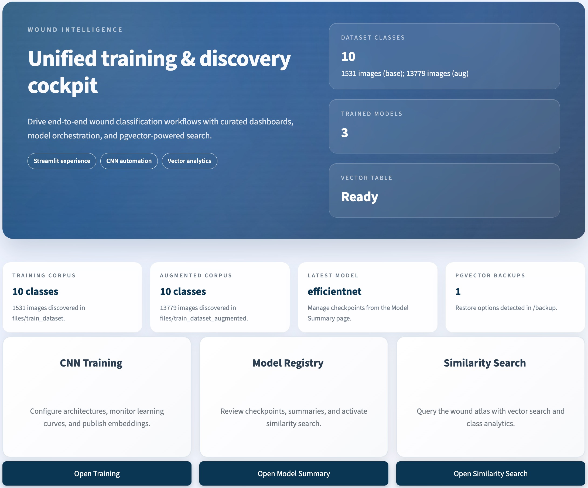
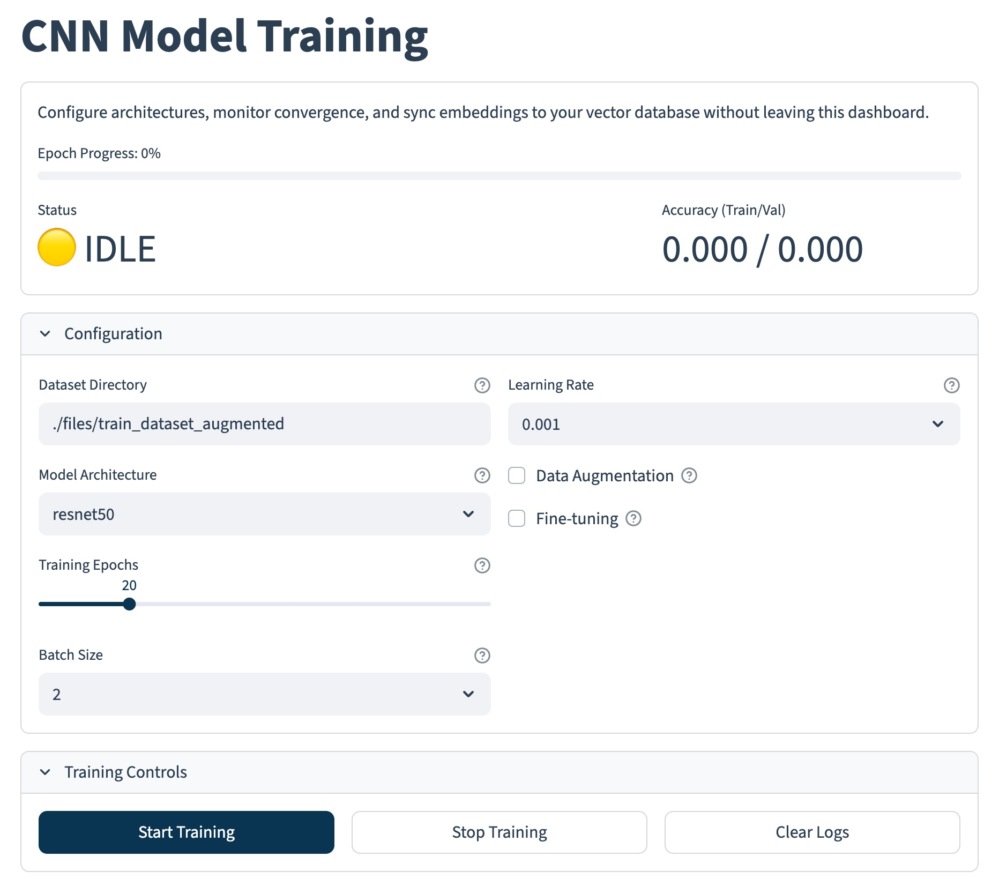
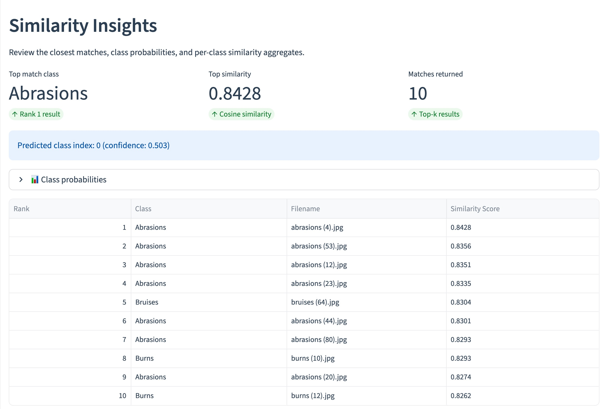
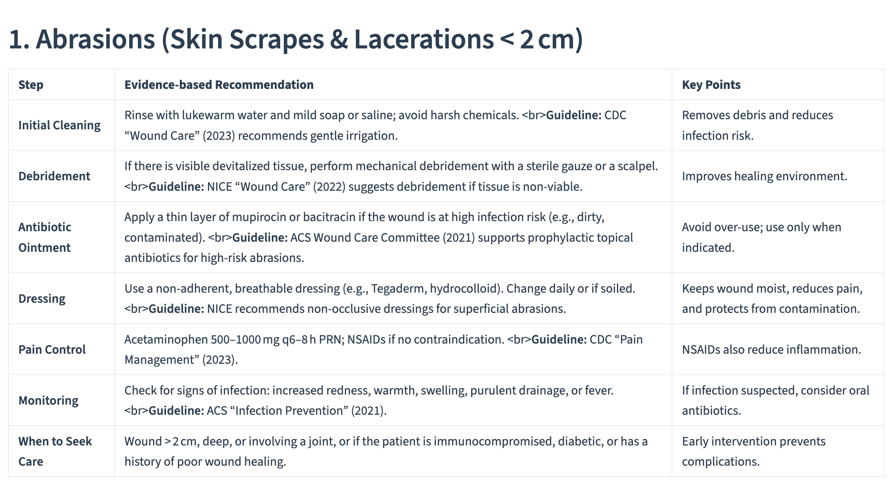

# 🩺 Wound Analysis & Classification Platform

[](https://www.python.org/downloads/release/python-3120/)
[](https://www.tensorflow.org/)
[](https://streamlit.io/)
[](https://www.postgresql.org/)
[](https://www.docker.com/)
[](https://opensource.org/licenses/MIT)

> **A comprehensive AI-powered toolkit for clinical wound image analysis, classification, and similarity-based retrieval.**

---

## 📖 Overview

This project is a **Deep Learning-based Medical Imaging Platform** designed to assist clinicians and researchers in analyzing wound images. It combines state-of-the-art **Convolutional Neural Networks (CNNs)** for multi-class classification with **Vector Similarity Search** to retrieve visually similar historical cases.

Beyond simple classification, the system integrates **Generative AI (LLMs via Ollama)** to provide automated medical opinions and treatment recommendations based on visual analysis, acting as an intelligent second opinion for medical professionals.

### 🎯 Key Capabilities

*   **🤖 Multi-Class Classification**: Accurately identifies 10+ wound types (e.g., Diabetic Wounds, Venous Ulcers, Burns) using robust backbones like **ResNet50**, **EfficientNet**, and **VGG16**.
*   **🔍 Visual Similarity Search**: Retrieves similar historical cases from a vector database using **1536-dimensional embeddings** and **Cosine Similarity** (powered by PostgreSQL + `pgvector`).
*   **💬 AI Medical Assistant**: Integrates with **Ollama** to generate treatment recommendations and medical insights based on classification results.
*   **📊 Interactive Dashboard**: A user-friendly **Streamlit** interface for model training, dataset exploration, and real-time inference.
*   **⚡ Optimized Pipeline**: Supports **Apple Metal (MPS)** acceleration for Mac users and Docker-based deployment for reproducibility.

---

## 📸 Interface Gallery

### 1. Main Dashboard

*Central hub for navigation and project overview.*

### 2. Dataset Analytics

*Comprehensive breakdown of class distributions and dataset statistics.*

### 3. Model Training Hub

*Real-time training configuration and monitoring.*

### 4. AI-Powered Analysis & Similarity Search

*Visual similarity search finding comparable historical cases.*

### 5. LLM Treatment Recommendations

*Generative AI providing treatment suggestions based on diagnosis.*

---

## 🛠️ Tech Stack & Architecture

The solution is built on a modern, modular architecture:

| Component | Technology | Description |
|-----------|------------|-------------|
| **Frontend** | **Streamlit** | Interactive web dashboard for all user workflows. |
| **Deep Learning** | **TensorFlow / Keras** | Model training (ResNet50, EfficientNet, VGG16). |
| **Vector DB** | **PostgreSQL + pgvector** | Storage and retrieval of high-dimensional image embeddings. |
| **GenAI / LLM** | **Ollama** | Local LLM inference for medical text generation. |
| **Data Processing** | **Pandas / NumPy** | Data manipulation and augmentation pipelines. |
| **Deployment** | **Docker & Docker Compose** | Containerized environment for consistent execution. |

### 📂 Project Structure

```text
dl-fall-2025/
├── 📱 app-streamlit/       # Frontend Application
│   ├── components/         # Reusable UI widgets (Cards, Headers)
│   ├── functions/          # App logic (Visualization, DB helpers)
│   ├── pages/              # Streamlit pages (Training, Search, Summary)
│   └── Dockerfile          # Frontend container definition
├── 🧠 core/                # Backend Core Library
│   ├── model_utils.py      # CNN definitions & training logic
│   ├── image_similarity.py # Vector search implementation
│   ├── ollama_client.py    # LLM API integration
│   ├── database.py         # PostgreSQL connection handler
│   └── data_processing.py  # Dataset loading & transformation
├── 💾 files/               # Data Storage
│   ├── train_dataset/      # Raw training images (categorized)
│   └── train_dataset_aug/  # Augmented dataset
├── 📦 models/              # Model Artifacts
│   ├── efficientnet/       # EfficientNet weights & metrics
│   ├── resnet50/           # ResNet50 weights & metrics
│   └── vgg16/              # VGG16 weights & metrics
├── train_model.py          # CLI entry point for training
├── generate_vectors.py     # CLI for embedding generation
├── database_backup.py      # Backup/Restore utilities
└── 🐳 docker-compose.yml   # Service orchestration
```

---

## 🚀 Getting Started

### Prerequisites
*   **Docker Desktop** (Recommended)
*   **Python 3.12+** (For local development)
*   **Git**

### ⚡ Quick Launch (Docker)

The easiest way to run the full platform (App + Database) is via Docker.

1.  **Clone the Repository**
    ```bash
    git clone https://github.com/hyper07/dl-fall-2025.git
    cd dl-fall-2025
    ```

2.  **Start Services**
    ```bash
    docker-compose up --build
    ```

3.  **Access the App**
    *   **Dashboard**: [http://localhost:48501](http://localhost:48501)
    *   **PostgreSQL**: `localhost:45432`

### 💻 Local Development Setup

If you prefer running the Python code directly:

1.  **Install Dependencies**
    ```bash
    pip install -r requirements.txt
    ```

2.  **Setup Environment**
    Copy the example environment file and configure your database credentials if needed.
    ```bash
    cp .env.example .env
    ```

3.  **Run Streamlit App**
    ```bash
    streamlit run Home.py
    ```

---

## 🧪 Usage Workflow

### 1. Model Training
Train a new wound classification model using the CLI or UI.

```bash
# Example: Train EfficientNet with MPS acceleration (Mac)
python train_model.py --architecture efficientnet --device mps --epochs 20
```

### 2. Vector Generation
Extract features from your trained model to populate the vector database.

```bash
# Generate embeddings for all images in the dataset
python generate_vectors.py
```

### 3. Similarity Search & Analysis
Open the Streamlit app and navigate to **Similarity Search**.
*   Upload a wound image.
*   The system will predict the wound class.
*   It will search for the top 10 most similar past cases.
*   The LLM will generate a preliminary assessment.

---

## 📊 Models & Performance

The platform supports three primary architectures, each serving different needs:

*   **ResNet50**: Balanced performance and speed. Excellent feature extractor for embeddings.
*   **EfficientNet** (Default): High accuracy with lower parameter count. Best for resource-constrained environments.
*   **VGG16**: Simple, deep architecture. Good for educational purposes and feature visualization.

*Current benchmarks show **77%+ accuracy** on the standard wound dataset for EfficientNet.*

---

## 👥 Team & Contributors

*   **Sally Park** ([@sallyp0318](https://github.com/sallyp0318))
*   **Wendy Luu** ([@wendyluu01](https://github.com/wendyluu01))
*   **Kibaek Kim** ([@hyper07](https://github.com/hyper07))


## 📄 License

This project is licensed under the MIT License. See [LICENSE](LICENSE) for details.

---

<div align="center">
  <sub>Built with ❤️ by the Deep Learning Fall 2025 Team</sub>
</div>
